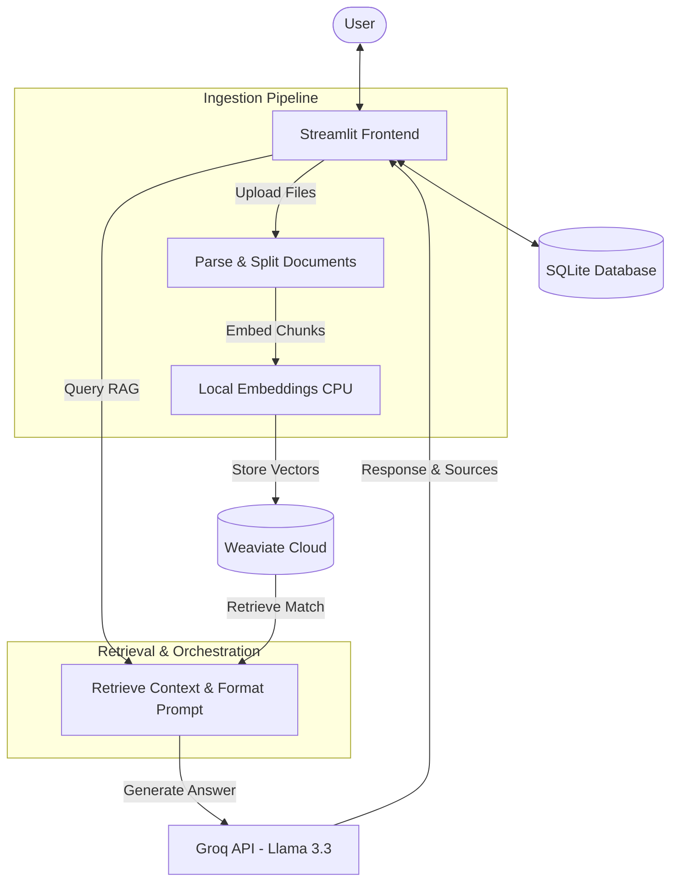

# Document QA Assistant (RAG Pipeline)

A Streamlit web application to chat with your documents (PDF, Word, Text, Markdown) using a RAG pipeline powered by Weaviate and Groq.

---

## System Architecture



---

## Technology Stack & Models

### Technology Stack
- **Frontend / UI**: Streamlit
- **Orchestration**: LangChain
- **Vector Database**: Weaviate Cloud
- **Relational Database**: SQLite
- **File Processing**: pypdf, python-docx

### Models
- **Embedding Model**: BAAI/bge-base-en-v1.5
- **Large Language Model (LLM)**: llama-3.3-70b-versatile
---

## Supported File Formats
- PDF (.pdf)
- Microsoft Word (.docx)
- Plain Text (.txt)
- Markdown (.md)

---

## Quick Start

### 1. Installation
```bash
# Clone the repository
git clone https://github.com/sattyaaa/ChatWithDocs.git
cd QADoc

# Create and activate virtual environment
python -m venv .venv
source .venv/bin/activate  # On Windows: .venv\Scripts\activate

# Install requirements
pip install -r requirements.txt
```

### 2. Environment Configuration
Create a `.env` file in the root directory:
```env
GROQ_API_KEY=your_groq_api_key_here
WEAVIATE_URL=your_weaviate_cluster_url_here
WEAVIATE_API_KEY=your_weaviate_api_key_here
```

### 3. Run the App
```bash
streamlit run app.py
```
Visit `http://localhost:8501` to start.
