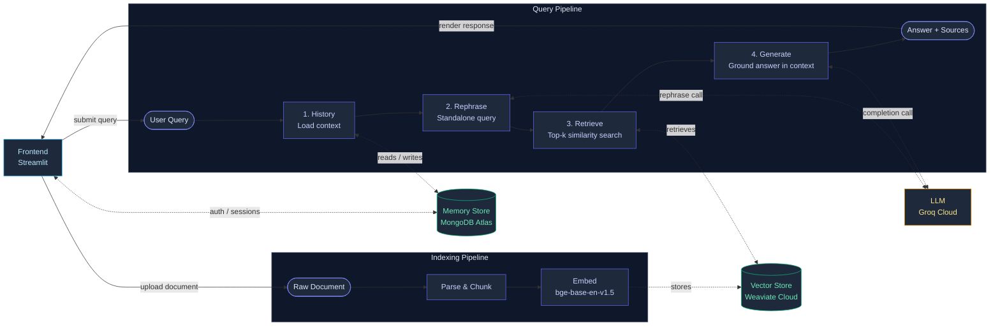

# Document QA Assistant (RAG Pipeline)

A Streamlit web application to chat with your documents (PDF, Word, Text, Markdown) using an agentic RAG pipeline powered by Weaviate, MongoDB, and Groq.

---

## System Architecture

Two distinct pipelines operate in this system — one for **indexing documents** and one for **answering queries**. Both converge on the Vector Store.



---

## Technology Stack & Models

### Technology Stack
- **Frontend / UI**: Streamlit (modular layout in `ui/`)
- **Orchestration**: LangGraph (compiled state machine workflow)
- **Vector Database**: Weaviate Cloud (with native Multi-Tenancy per user)
- **NoSQL Database**: MongoDB Atlas (persisting chat sessions, history, and users)
- **Caching Layer**: Redis (for caching chat session messages)
- **File Processing**: pypdf, python-docx

### Models
- **Embedding Model**: BAAI/bge-base-en-v1.5
- **Query Rephraser LLM**: `llama-3.1-8b-instant` (via Groq, low-latency)
- **QA Generator LLM**: `llama-3.3-70b-versatile` (via Groq)

---

## Supported File Formats
- PDF (.pdf)
- Microsoft Word (.docx)
- Plain Text (.txt)
- Markdown (.md)

## Quick Start

### 1. Installation
```bash
# Clone the repository
git clone https://github.com/sattyaaa/ChatWithDocs.git
cd ChatWithDocs

# Create and activate virtual environment
python -m venv .venv
.venv\Scripts\Activate.ps1

# Install requirements
pip install -r requirements.txt
```

### 2. Environment Configuration
Create a `.env` file in the root directory:
```env
GROQ_API_KEY=your_groq_api_key_here
WEAVIATE_URL=your_weaviate_cluster_url_here
WEAVIATE_API_KEY=your_weaviate_api_key_here
MONGODB_URI=your_mongodb_connection_string_here
```

### 3. Run the App
```bash
streamlit run app.py
```
Visit `http://localhost:8501` to start.
