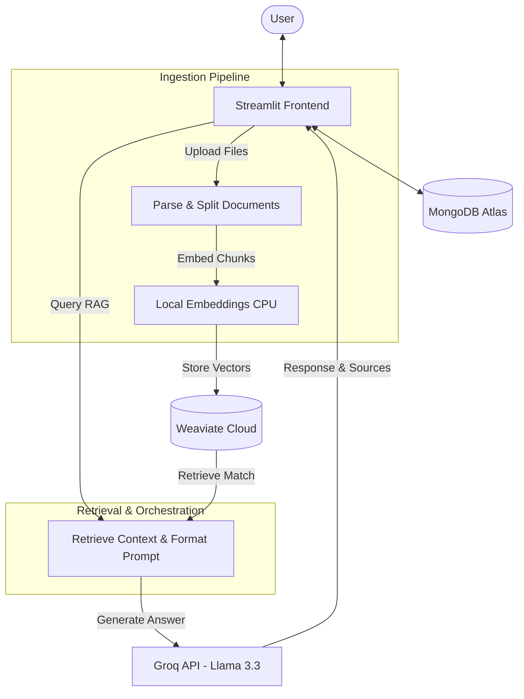

# Document QA Assistant (RAG Pipeline)

A Streamlit web application to chat with your documents (PDF, Word, Text, Markdown) using a RAG pipeline powered by Weaviate and Groq.

---

## System Architecture



---

## Technology Stack & Models

### Technology Stack
- **Frontend / UI**: Streamlit
- **Orchestration**: LangChain
- **Vector Database**: Weaviate Cloud
- **NoSQL Database**: MongoDB Atlas
- **File Processing**: pypdf, python-docx

### Models
- **Embedding Model**: BAAI/bge-base-en-v1.5
- **Large Language Model (LLM)**: llama-3.3-70b-versatile
---

## Supported File Formats
- PDF (.pdf)
- Microsoft Word (.docx)
- Plain Text (.txt)
- Markdown (.md)

---

## Database Schema

The application uses two database systems: MongoDB Atlas for chat session/message persistence and Weaviate for vector storage.

### MongoDB (NoSQL Document Database)
Stored in a remote MongoDB Atlas cluster (`docqa_chat` database). It consists of two collections:
- **chats**:
  - `_id` / `chat_id` (String, Primary Key): Unique identifier (UUID) for the chat session.
  - `title` (String): Title of the chat session.
  - `created_at` (Date): Creation timestamp.
  - `updated_at` (Date): Last updated timestamp.
- **messages**:
  - `_id` (ObjectId, Primary Key): Unique identifier for the message.
  - `chat_id` (String): ID of the chat session the message belongs to.
  - `role` (String): Sender role (`user` or `assistant`).
  - `content` (String): The message content.
  - `created_at` (Date): Timestamp when the message was saved.

### Weaviate (Vector Database)
A collection named `Documents` stores the ingested document chunks:
- **Properties**:
  - `text` (TEXT): Raw text content of the chunk.
  - `chat_id` (TEXT): ID of the chat session the document is associated with.
  - `document_id` (TEXT): Unique identifier of the uploaded document.
  - `filename` (TEXT): Name of the source file.
  - `page` (INT): Page number of the chunk (applicable for PDFs).
  - `chunk_id` (TEXT): Segment sequence identifier.
  - `source` (TEXT): Source reference path.

---

## Quick Start

### 1. Installation
```bash
# Clone the repository
git clone https://github.com/sattyaaa/ChatWithDocs.git
cd ChatWithDocs

# Create and activate virtual environment
python -m venv .venv
source .venv/bin/activate  # On Windows: .venv\Scripts\activate

# Install requirements
pip install -r requirements.txt
```

### 2. Environment Configuration
Create a `.env` file in the root directory:
```env
GROQ_API_KEY=your_groq_api_key_here
WEAVIATE_URL=your_weaviate_cluster_url_here
WEAVIATE_API_KEY=your_weaviate_api_key_here
MONGODB_URI=your_mongodb_connection_string_here
```

### 3. Run the App
```bash
streamlit run app.py
```
Visit `http://localhost:8501` to start.
